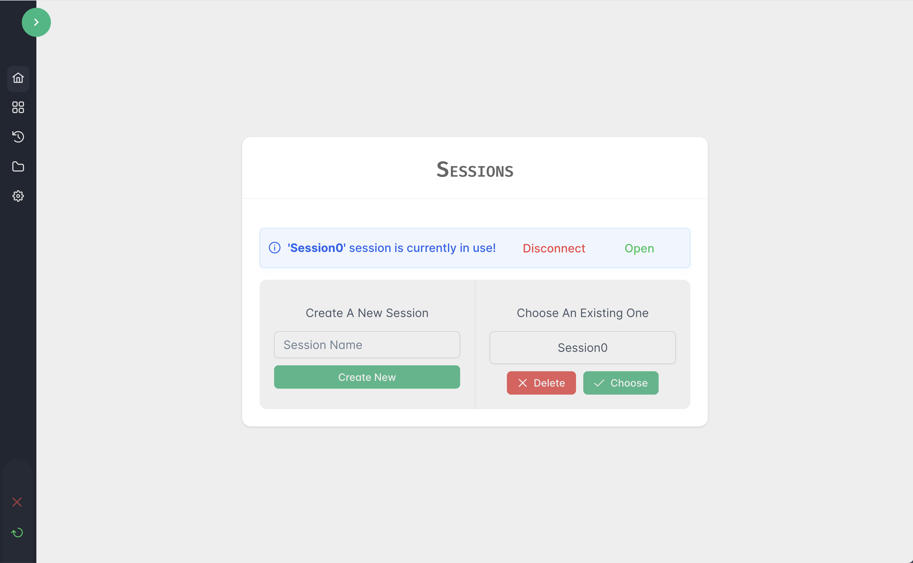
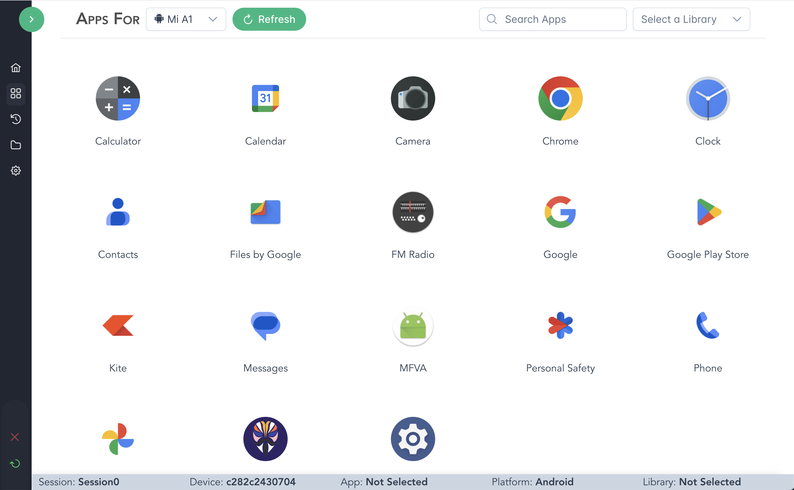
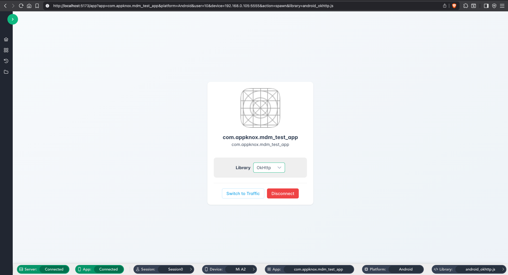
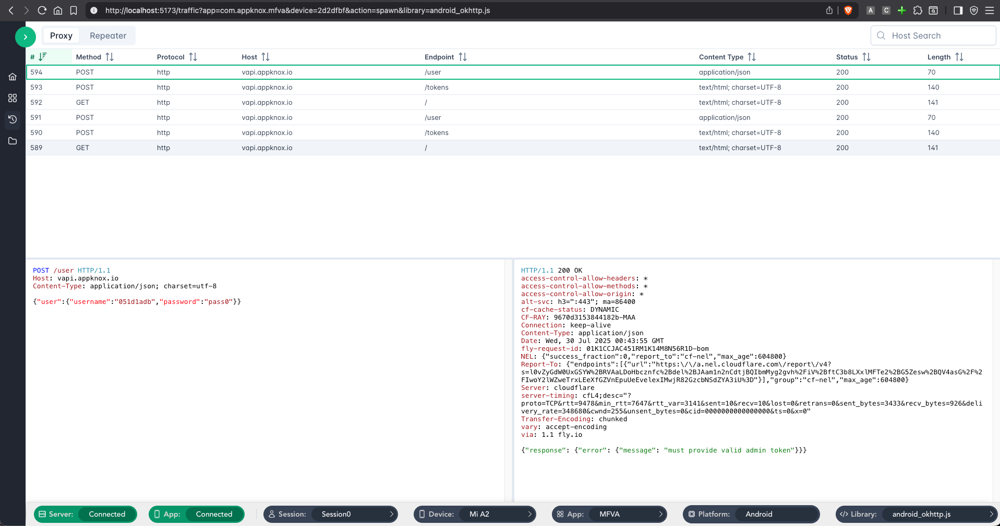

# 🔍 KnoxSpy

<div align="center">

### **Breaking the Proxy Barrier: Advanced Network Traffic Interception for MDM Applications**

*A cutting-edge Frida-based tool for bypassing certificate pinning and intercepting network traffic from mobile applications that resist traditional proxy methods.*


</div>

---

## 🚀 **The Problem**

Traditional proxy tools like **Burp Suite** fail when dealing with:
- 📱 **Mobile Device Management (MDM)** applications
- 🔒 **Certificate pinning** implementations
- 🛡️ **Custom security protocols**
- 🔐 **TLS/SSL bypass restrictions**
- 🌐 **Devices using VPN connections**


**KnoxSpy** solves this by hooking directly into popular network libraries at **runtime**, even when the API traffic is routed through a VPN.

---

## 🎯 **Key Features**

### 🔥 **Advanced Interception**
- **Runtime Hooking**: Bypass certificate pinning and security restrictions
- **Multi-Platform**: Android (OkHttp3) and iOS (Alamofire/AFNetworking) support
- **Real-Time Analysis**: Live traffic capture and analysis

### 🤖 **AI-Powered Hook Generation (New!)**
Powered by the new **`apk-network-hook-generator`** skill, KnoxSpy now writes its own hooks:
- **Zero-Touch Decompilation**: Automatically reverse-engineers any arbitrary APK to expose its underlying architecture.
- **Smart Network Discovery**: Dynamically detects the app's framework (Native, Flutter, React Native) and pinpoints obfuscated HTTP libraries.
- **Instant Weaponization**: Generates ready-to-deploy, `frida-compile` compatible TypeScript agents that seamlessly bypass security protections and stream traffic directly into KnoxSpy.

### 🛠️ **Professional Toolkit**
- **Traffic Replay**: Replay captured requests for testing
- **Session Management**: Multiple concurrent testing sessions

### 🎨 **Modern Interface**
- **Vue.js Frontend**: Responsive, intuitive web interface
- **WebSocket Integration**: Real-time updates and communication

---

## 📸 **Screenshots**

### Session Management


*Create and manage multiple testing sessions with different devices and applications*

### Application Discovery


*Browse and select applications on connected Android and iOS devices*

### Library Attachment


*Automatically detect and attach to network libraries (OkHttp3 shown)*

### Traffic Analysis


*Capture, analyze, and modify network traffic in real-time*

---

## ⚡ **Quick Start**

### 🔧 **Prerequisites**
- **Frida Server** 16.2.1 installed on target device
- **Node.js** 18+ for development
- **Android/iOS** device with USB debugging enabled

> **Note:** Android device has to be rooted

### 🚀 **Installation**

```bash
# Clone the repository
git clone https://github.com/appknox/knoxspy.git
cd knoxspy

# Install dependencies
cd app/gui && npm install
cd ../server && npm install
cd ../..

# Start the application
./knoxspy
```

### 🎯 **Usage**

1. **Connect Device**: Ensure Frida server is running on your target device
2. **Launch KnoxSpy**: Run `./knoxspy` to start both frontend and backend
3. **Access Interface**: Open http://localhost:5173 in your browser
4. **Create Session**: Set up a new testing session
5. **Select App**: Choose the target application from the device
6. **Select Library**: Choose the library being used by the application
7. **Capture Traffic**: Switch to the Proxy tab and start intercepting

---

## 🔬 **Technical Deep Dive**

### 🏗️ **Architecture**
- **Frontend**: Vue.js 3 + TypeScript + PrimeVue
- **Backend**: Node.js + Express + WebSocket
- **Database**: SQLite for session and library management
- **Instrumentation**: Frida + Custom JavaScript/TypeScript agents

### 🎭 **Supported Libraries**
| Platform | Library | Coverage |
|----------|---------|----------|
| Android | OkHttp3 | ✅ Full Support |
| iOS | Alamofire | ✅ Full Support |
| iOS | AFNetworking | ✅ Full Support |
| Custom | User Scripts | ✅ Extensible |

### 🔌 **Custom Agent Support**
Upload your own Frida agents as ZIP files:
- Must contain `package.json`
- TypeScript source automatically compiled
- Stored in `libraries/` directory
- Database tracking for metadata

> **Note on Frida 17+:** Due to changes in Frida 17, plain JavaScript hook scripts that rely on the `Java` global object no longer work. Custom agents must now be bundled using `frida-compile` and explicitly include `frida-java-bridge` to function correctly.

**Example: Writing and Compiling a Custom Hook**

1. Create your hook in a TypeScript file (`custom_hook.ts`):
```typescript
import Java from "frida-java-bridge";
(globalThis as any).Java = Java;

Java.perform(() => {
    console.log("Hooking into Java API...");
    // Your hook logic here
});
```

2. Compile it using `frida-compile`:
```bash
npx frida-compile custom_hook.ts -o custom_hook.js
```

3. Move `custom_hook.js` into the `libraries/` directory and update your configuration.

---

## 🎪 **DEF CON 31 Highlights**

### 🏆 **Research Impact**
- **MDM Security**: Exposing hidden vulnerabilities in enterprise applications
- **Mobile Pentesting**: New methodologies for bypassing modern security measures
- **Network Analysis**: Advanced techniques for traffic interception

### 🔥 **Live Demo Features**
- **Real-time MDM app analysis**
- **Certificate pinning bypass demonstrations**
- **Custom agent deployment**
- **Enterprise application security testing**

---

## 🛡️ **Security & Ethics**

### ⚖️ **Responsible Use**
- **Authorized Testing Only**: Use only on applications you own or have permission to test
- **Research Purpose**: Designed for defensive security research and penetration testing
- **Compliance**: Ensure compliance with local laws and regulations

### 🔒 **Security Features**
- **Session Isolation**: Each testing session is properly isolated
- **Secure Communication**: WebSocket connections with proper validation
- **File Validation**: Uploaded agents undergo security checks

---

## 🚧 **Development**

### 🔨 **Building from Source**
```bash
# Frontend development
cd app/gui
npm run dev

# Backend development
cd app/server
npm run dev

# Production build
cd app/gui
npm run build
```

### 🧪 **Testing**
```bash
# Run frontend tests (when available)
cd app/gui
npm run test

# Run backend tests (when available)
cd app/server
npm run test
```

---

## 📚 **Documentation**

### 📖 **Additional Resources**
- **Whitepaper**: [Demystifying Network Libraries for Mobile Security](https://www.appknox.com/resources/ebooks/demystifying-network-libraries)


### 🔗 **References**
- [Frida Documentation](https://frida.re/docs/)
- [OkHttp3 Official Guide](https://square.github.io/okhttp/)
- [Alamofire Documentation](https://github.com/Alamofire/Alamofire)

---

## 🤝 **Contributing**

We welcome contributions from the security research community! Feel free to:
- Report bugs and issues
- Submit feature requests
- Contribute code improvements
- Share your custom Frida agents
- Improve documentation

### 🌟 **Contributors**
- Security researchers and penetration testers
- Mobile application developers
- Network security professionals

---

## 📄 **License**

This project is licensed under the **Apache License 2.0** - see the [LICENSE](LICENSE) file for details.

---

## 🎯 **About Appknox**

KnoxSpy is developed by [Appknox](https://www.appknox.com), a leading mobile security company dedicated to making mobile applications more secure through innovative security testing tools and platforms.

---

<div align="center">

### **Ready to Break the Proxy Barrier?**

**Star ⭐ this repository if you find it useful!**

[🚀 **Get Started**](#-quick-start) • [📸 **View Screenshots**](#-screenshots) • [🔬 **Technical Details**](#-technical-deep-dive) • [🛡️ **Security**](#-security--ethics)

</div>

---

*Made with ❤️ for the security research community*
