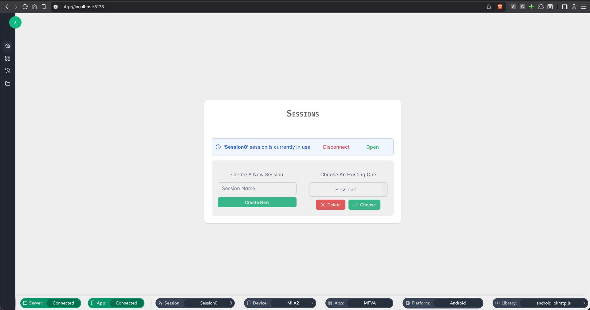
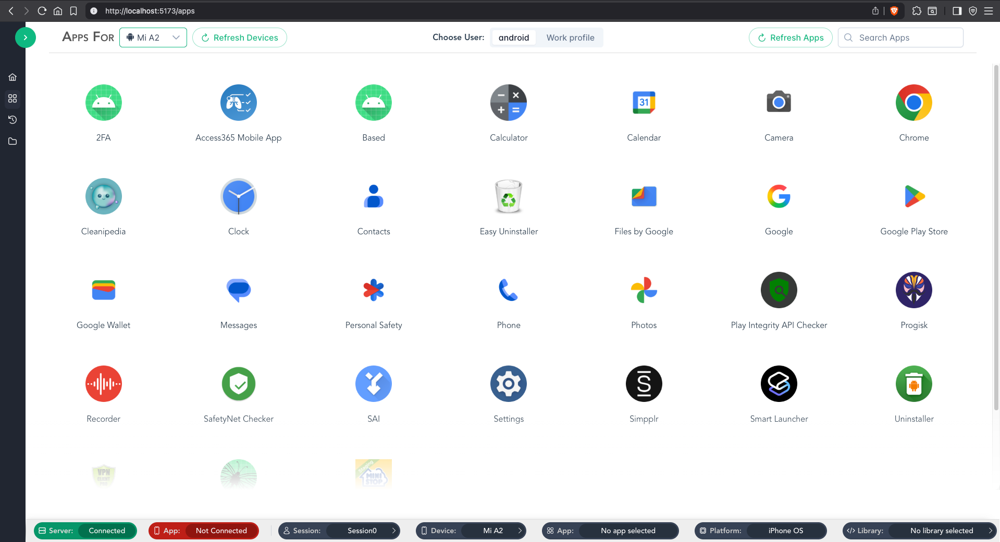

# KnoxSpy





### Installation
1. Clone the repo:
    ```bash
    git clone https://github.com/appknox/knoxspy.git
    ```
2. Install dependencies:
    ```bash
    cd knoxspy
    cd app/gui && npm i
    cd ../server && npm i
    cd ../..
    ```
### Usage

1. Install and start frida server on the device & connect it.
2. Run `./knoxspy` shell script to start server & client.
3. Open http://localhost:5173 to access the app.
4. Create a new session and open it.
5. Spawn the target app and attach the network library script to it.
6. Open proxy tab and start capturing APIs.

> [!NOTE]
> You can provide your own script and use it instead of bundled scripts.
