# Finding Key Flutter Network Addresses - A Security Researcher's Guide

**Date**: November 20, 2025

## Overview

This guide provides a step-by-step methodology for security researchers to identify critical function addresses in Flutter applications for network traffic interception. We will locate 5 key addresses in `libflutter.so` that are essential for capturing HTTP/HTTPS requests and responses.

## Prerequisites

- **Tools Required**:
  - IDA or Ghidra (for binary analysis)(I have used ida)
  - Frida (version 16) (For testing)
  - ADB (For testing)
  - A rooted Android device or emulator (For testing)
  
- **Knowledge Required**:
  - Basic understanding of ARM/x86_64 assembly

## Target Addresses

We need to find the following 5 function addresses in `libflutter.so`:

1. **Socket_WriteList** - Where HTTP requests are written
2. **SocketBase::Read** - Where HTTP responses are read
3. **SSL_Write** (HTTPS only) - Where HTTPS requests are written
4. **SSL_Read** (HTTPS only) - Where HTTPS responses are read
5. **SSL_Free** (HTTPS only) - SSL pointer is destroyed

---

## General Setup

Before starting, ensure you have:
- Decompiled the Flutter APK and extracted `libflutter.so` 
- Loaded `libflutter.so` in IDA or Ghidra with analysis complete
- Selected the correct architecture version (arm64-v8a, armeabi-v7a, x86_64) (arm64-v8a is shown here since that is most used architecture in modern devices)

---

## Part 1: Finding Socket_WriteList

1. Wait for IDA to complete auto-analysis
2. Press `Ctrl + Shift + p`
3. Seach for Strings and double click on it to open the strings window
4. Press `Ctrl + F` in the IDA View window
5. Search for: `Socket_WriteList`
Note: Sometimes only `SynchronousSocket_WriteList` appears; continue anyway
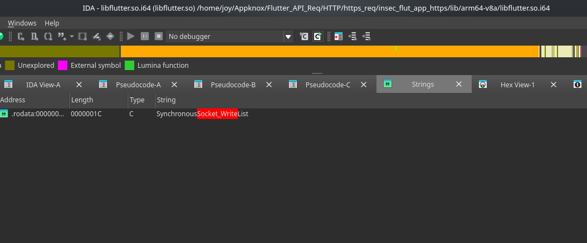
6. Once found, double-click on the string reference

You will see the xref's screen. You can see 2 xref
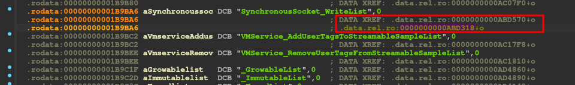

7. Double click on the 2nd one. You will see the offset of the function `Socket_WriteList`

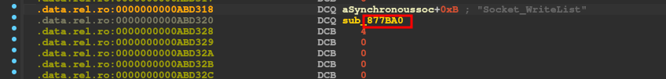
8. `0x877BA0` is the offset. Replace the one in the ts script in the agent


---

## Part 2: Finding SocketBase::Read

### Step 1: Understand the Function Signature

From the source code analysis, `SocketBase::Read` has this signature:
```cpp
intptr_t SocketBase::Read(int fd, void* buffer, intptr_t length, int async_flag)
```

Key characteristic: The 4th parameter is a constant `1` (SocketBase::kAsync)

### Step 2: Search Using Parameter Matching

**Method: Look for calls with constant value 1**

1. In IDA, search for `Socket_Read` function (similar to Step 2-5 from Part 1)(If it is SynchronousSocket_Read click on it and double click on the 2nd xref)
2. Once found, double click into the function and look at the disassembly or pseudocode for calls to other functions
3. Look for a call instruction where the 4th parameter is constant `1`

**Disassembly pattern (ARM64):**
```asm
LDR             X0, [X22,#0x10]  ; First parameter = socket fd
MOV             X1, X20          ; Second parameter = buffer
MOV             X2, X21          ; Third parameter = length
MOV             W3, #1           ; Fourth parameter = 1 (SocketBase::kAsync)
BL              sub_87D98C       ; Call to SocketBase::Read
```

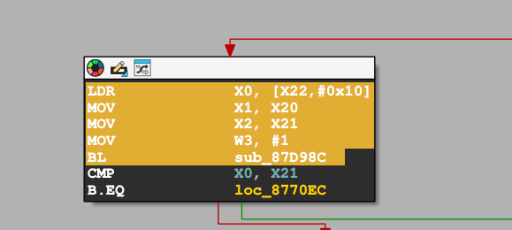

4. `0x87D98C` is the offset. Replace the one in the ts script in the agent

---

## Part 3: Finding SSL_Write

SSL functions in Flutter are part of the embedded BoringSSL library and won't appear as simple string searches. We need to find them through error messages and source code pattern matching.

### Step 1: Search for the Error Message

1. In IDA Strings window, search for: `Out-of-bounds internal buffer access in dart:io SecureSocket`
2. This string is used in the `ProcessAllBuffers` function which gets expanded and has both `SSL_Write` and `SSL_Read
3. Double-click on the string reference to see its xrefs

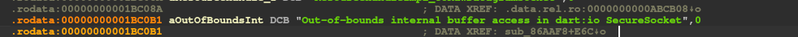

### Step 2: Go to the ProcessAllBuffers Function

1. Double-click on the xref to jump to this function
2. Then follow the flow :- 
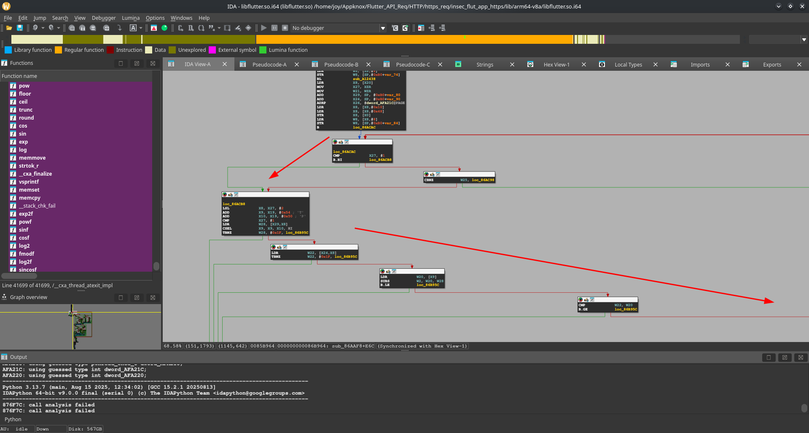
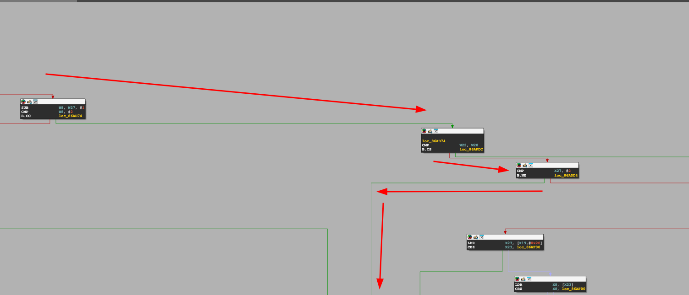
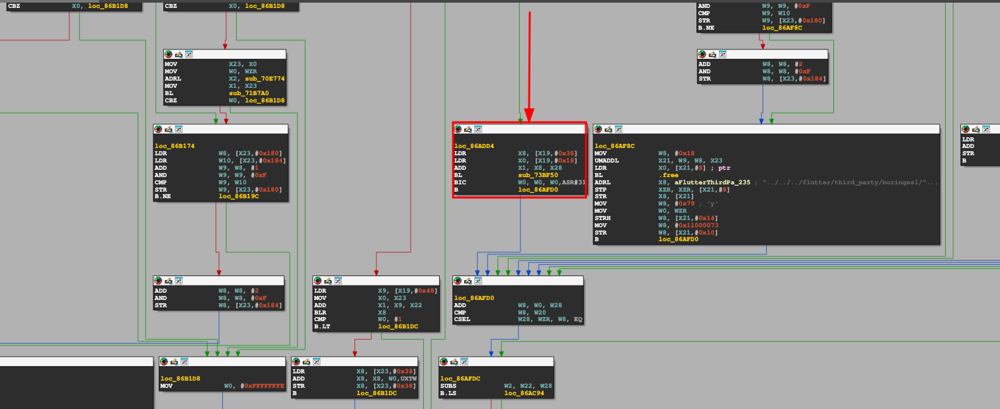

3. `0x73BF50` is the offset. Replace the one in the ts script in the agent

---

## Part 4: Finding SSL_Read

SSL_Read is in the same `ProcessAllBuffers` function, just a different branch.

1. Follow the same steps as for `SSL_Write`
2. Then follow the flow :-

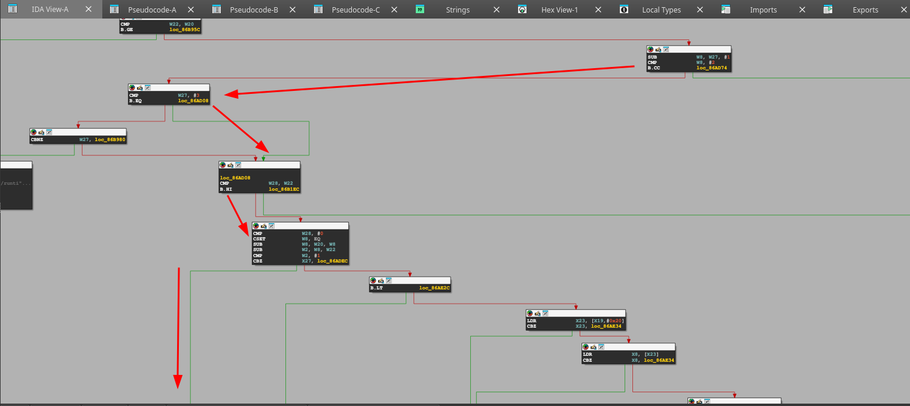
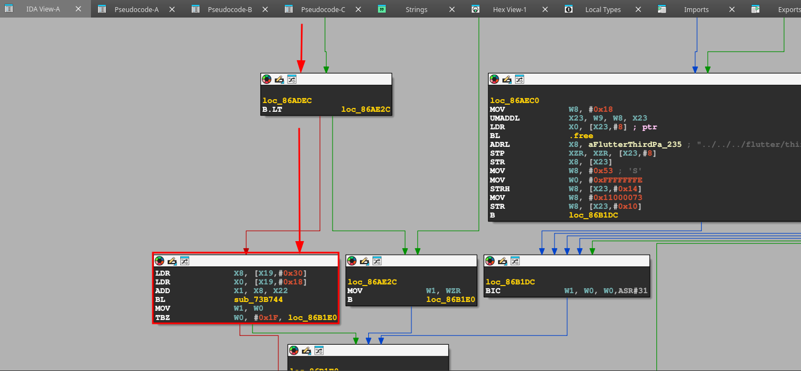

3. `0x73B744` is the offset. Replace the one in the ts script in the agent

---

## Part 5: Finding SSL_Free

SSL_Free is called when the SSL connection is destroyed. This is important for tracking when a request-response pair is complete.

### Step 1: Search for SecureSocket_Init

1. In IDA Strings window, search for: `SecureSocket_Init`
2. Double-click on the string reference
3. Look at the xrefs - click on the 1st one.
4. Double click on the function and press `F5` or `fn + F5` to see the pseudocode.

### Step 2: Find the Destroy Function

1. In the `SecureSocket_Init` function, scroll to the end
2. Double click on the function having `started` as a parameter. This is basically the destroyer function.
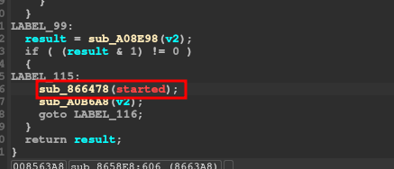

3. Double-click to enter the `Destroy` function

### Step 3: Find SSL_Free

1. Inside `SSLFilter::Destroy find the condition `if ( a1[3] )`
2. Inside the condition, the function which is called is `SSL_Free`

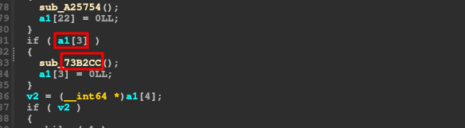

3. `0x73B2CC` is the offset. Replace the one in the ts script in the agent

---

## Summary

Now you should have all 5 addresses:

```javascript
const offsets = {
    Socket_WriteList: 0x877BA0,    // HTTP requests
    SocketBase_Read: 0x87D98C,     // HTTP responses
    SSL_Write: 0x73BF50,           // HTTPS requests (plaintext)
    SSL_Read: 0x73B744,            // HTTPS responses (plaintext)
    SSL_Free: 0x73B2CC,            // SSL connection cleanup
};
```

## Important Notes

1. **Architecture-Specific**: These offsets are for **arm64-v8a**. You must find new offsets for other architectures (armeabi-v7a, x86_64).

2. **Flutter Version**: Offsets change between Flutter engine versions. Always verify for your target app.

3. **Testing**: Always test the script on a sample app before using on production targets.

